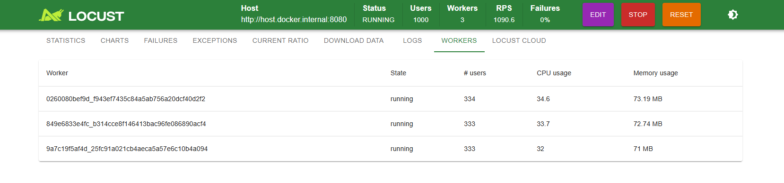

sql 폴더는 기본 테이블 생성 

# coupon 프로젝트 내용 정리
1. my-sql 에서 cpu (ex 50~60%)가 잡히는 굉장히 안좋은 방식인거다

# 강의 ch4 04보면 된다
2. 부하테스트를 했는데 쿠폰 발급을 db에서 조회했더니 500 명이상이 발급 받았다 
내가 원하는 형태의 값이 안나옴 이때 뜻하는게 동시성이슈라고한다
동시성이슈는 쿠폰 발급 요청이 동시에 발생 되면서 쿠폰 발급처리가 따로 처리안되고 동시에 처리되면서 1로 처리 되어서 발생
### 해결방법 : 쿠폰 발급 요청이 동시에 발생되는 경우 lock을 걸어주면 된다 
### lock을 적용한다는 의미 : 공유 자원을 동시에 접근해서 문제가 될 수 있는 부분을 순차 처리
### 그런데 lock은 처리량의 병목이 발생 이렇게 하면 db에서는 정확하게 수량을 제어할수 있지만 처리량에서는 병목이 생길수 밖의 없다 
### lock은 가능한 범위를 작게 가져 가는게 좋다 
### synchronized (this)는 멀티 서버 환경이나 Spring Bean 환경에서는 거의 작동하지 않습니다.
### 그러므로 이걸 거면 제대로 동작하지 않는다 참고하기 

# 락을 건상테 
3. 락을 건상태에서 발생한 동시성 이슈 
@Transactional
public void issue(long couponId, long userId) {
// synchronized 이거를 걸어주면 첫번쨰 요청이 들어오면 락을 획득한다 그러면서 내부 로직을 실행
// 두번째 요청이 들어오면 첫번째 요청 lock이 끝나고 자신이 lock을 획득 할 수 있을때까지 동작을 안한다
synchronized (this) { // 동기화 처리하므로서 락을 걸 수 있다 하지만 실무에서는 이방식을 사용 안한다
Coupon coupon = findCoupon(couponId);
coupon.issue();
saveCouponIssue(couponId, userId);
}
}

    //synchronized 이걸로 락을 걸어도 동시성 이슈( 쿠폰 발급 500 개가 최대인데 동시성 이슈때문에 500명이상이 발급 받음)
    /* 실행 순서
    1.트랜재셕 시작

    2.lock 획득

    3. issue() =>
    Coupon coupon = findCoupon(couponId);
    coupon.issue();
    saveCouponIssue(couponId, userId);

    4.lock 반납

    5.트랜잭션 커밋
    */

이렇게 lock을 걸었는데도 동시성 이슈는 해결이 안됨
이유는 1번 쿠폰 발급요청이 lock까지는 반납은 했는데 트랜잭션 커밋 하기전에
2번 쿠폰 발급요청이 들어오면서 findCoupon으로 쿠폰을 조회 그러면 쿠폰 발급을 처리 안한 데이터를 조회하기 때문에
### 위 동시성 이슈 해결방법 
/* 실행 순서
    1.lock 획득

    2.트랜재션 시작

    3. issue() =>
    Coupon coupon = findCoupon(couponId);
    coupon.issue();
    saveCouponIssue(couponId, userId);

    4.트랜잭션 커밋

    5.lock 반납
*/
이렇게 순서를 변경하면 동시성 이슈를 해결 
결론적으로 트랜잭션 안에서 락을 거는 행위는 주의해야한다 

# synchronized
4. 문제점
java application 에 종속이 되기 때문에 결국 여러 서버로 확장이 되는순간 lock을 제대로 관리 할수 없다는 문제점이 발생
### 해결방법 
분산 lock 방법을 사용
자신이 가지고 있는 기술 스택에서 lock을 구현 
1. mysql
2. redis

# mysql lock 처리
5. mysql lock
동시성 이슈 처리할때 mysql 에서 레코드lock(for update)을 걸어주면 된다
ex) select * from coupons where id =1 for update;
이렇게 하면 쿠폰 id =1 에 xlock이 걸린다 
Xlock 특징은 중첩해서 걸수가 없다 이말은
1번 유저가 쿠폰을 발급 받을때까지 2번 유저가 쿠폰 발급받을때 쿠폰을 조회해야하는데
이때 lock 이 걸린상태여서 조회가 안된다 
그리고 이제 1번 유저가 쿠폰을 발급받고 commit이 된순간 2번유저 쿠폰조회해서 발급 처리
이렇게 하면 동시성 이슈 해결 

# redis score 같은 값 문제
6. sotred set 문제점
정렬은 언제 바뀔지 모른다 여기서 문제는 정확하게 추가가 되는 시간대로 저장하지 않고
사전순으로 정렬을 해버리기 때문에 쿠폰 발급 문제가 생긴다

# 에러 발생
7. redis cache error 타입 불일치 때문에 발생
org.springframework.beans.factory.BeanCreationException: Error creating bean with name 'entityManagerFactory' defined in class path resource
[org/springframework/boot/autoconfigure/orm/jpa/HibernateJpaConfiguration.class]: Failed to initialize dependency 'cacheManager' of 
 LoadTimeWeaverAware bean 'entityManagerFactory': Error creating bean with name 'cacheManager' defined in class path resource 
 [org/springframework/boot/autoconfigure/cache/JCacheCacheConfiguration.class]: Unsatisfied dependency expressed through method 
 'cacheManager' parameter 1: Error creating bean with name 'redisCacheManager' defined in class path resource 
[com/example/coupon_core/configuration/CacheConfiguration.class]: Failed to instantiate [javax.cache.CacheManager]: 
Factory method 'redisCacheManager' threw exception with message: class org.springframework.data.redis.cache.RedisCacheManager cannot be cast to class javax.cache.CacheManager 
(org.springframework.data.redis.cache.RedisCacheManager and javax.cache.CacheManager are in unnamed module of loader 'app')

CacheConfiguration 에서 발생한에러 발생이유는
import org.springframework.cache.CacheManager;를 사용해야 할 곳에 import javax.cache.CacheManager;를 사용하여 타입 불일치(Type Mismatch)가 발생

해결 방법 import org.springframework.cache.CacheManager를 걸어 주면 된다 

# mysql,redis 성능 비교
mysql은 redis에 비해 rps 가 2배정도 높다 그리고 부하도 상당히 많이 받는다
그에반면 redis는 mysql에 lock을 거는것보다 성능면에서 확실히 더 좋다 

# cpu 확인 방법
ctrl+shift+esc

# locust 파일 변경시 
docker-compose down 을 해서 한 번 정리하고
docker-compose up -d --scale worker=3 해서 최신화를 한다 

# swagger 주소
http://localhost:8080/swagger-ui/index.html

https://github.com/prod-j/coupon-version-management

locust 사용법
https://pearlluck.tistory.com/825
https://velog.io/@hyeseong-int/Locust%EB%A1%9C-%EC%84%9C%EB%B2%84-%EC%84%B1%EB%8A%A5-%ED%85%8C%EC%8A%A4%ED%8A%B8%ED%95%98%EA%B8%B0

접속 주소(locust)
http://localhost:8089

locust 사용이유
왜 Locust?
우선 다른 부하 테스트 툴도 많지만 왜 이 Locust를 사용하면 어떤 이점이 있냐면,

Jmeter, nGrinder,SOAP UI 등의 도구는 사용과 스케일링을 하는데 어려움이 있는 반면에, locust는 설치와 사용이 편리하고, 
파이썬 스크립트로 작성을 하기 때문에 훨씬 빠르고 간편하게 부하 테스트를 해볼 수 있다.

# load-test 폴더
부하테스트를 위한 docker 파일이 있다
사용방법
파일들을 설정후 터미널에서 load-test 폴더로 이동 
docker-compose.yml 에 있는 command: -f /mnt/locust/locustfile-hello.py --master -H http://host.docker.internal:8080
locustfile-hello.py 이파일명하고 load-test 에있는 파일명하고 일치해야 도커가 동작한다 

worker:
image: locustio/locust
volumes:
- ./:/mnt/locust
command: -f /mnt/locust/locustfile-hello.py --worker --master-host master
이거는 부하를 생성해주는 용도이다 

docker-compose up -d --scale worker=3
이렇게 설정해주면 3개의 worker가 생성됨
이렇게 3개를 활용하며게 되면

# locust worker를 늘리는 이유 
Locust 워커 컨테이너를 3개로 늘려 CPU 부하를 분산시킵니다.

워커 컨테이너의 역할
Locust 워커는 실제로 부하를 생성하는 역할을 합니다.

하나의 마스터 컨테이너가 워커들에게 부하 테스트 실행 지시를 내리면, 각 워커 컨테이너는 할당된 수의 가상 사용자를 생성하여 목표 서버에 요청을 보냅니다.

부하 분산 효과
예를 들어, 총 3,000명의 사용자를 시뮬레이션해야 할 때, 워커가 하나뿐이라면 이 모든 부하를 하나의 CPU 코어가 처리하게 됩니다. 
이는 CPU 사용률을 급격히 높이고 성능 병목 현상을 일으킬 수 있습니다.

--scale worker=3 명령어로 워커를 3개로 늘리면, 각 워커는 약 1,000명씩의 부하를 나누어 처리합니다. 이렇게 여러 개의 CPU 코어에 
작업이 분산되어 전체적인 테스트 성능이 향상되고, Locust 자체의 부하로 인한 테스트 결과 왜곡을 줄일 수 있습니다.

# docker-compose locker-test(수정시) 다시 설정 방법
docker-compose 설정후 terminal 을 켜서 docker-compose up -d 를 하면 실행 된다

docker-compose down 에서 서버를 종료
docker-compose up -d --scale worker=3 을 해줘서 다시 설정

# redis helper 사용방법 
+를 누른후 connection name에는 내가 정한 레디스 이름 작성
host는 localhost인지 아니면 설정한 host 가 있으면 그걸 작성하면 된다
port는 6380 이면 그대로 작성 그리고 testconnection을 해보면 된다 

# 인텔리제이 active 변경 방법
https://lucas-owner.tistory.com/22#google_vignette
이걸 참고한다 

1. Ultimate (유료) 버전
- 굉장히 간단하게 설정 가능하다.

1-1. 우측 상단에 위치한 Edit Configuration 클릭

1-2. 기존 실행 Application 클릭후 Copy (기존의 실행환경이 복사됨)

1-3. 상세 옵션 변경 후 Apply. 끝!

옵션 및 추가 설명

1. Name : 실행할 application 셋팅 (프로파일별, 세팅의 변화가 있는 이름이 보기 편했다!)

2. Active profiles : 실행할 profile명 (properties, yml에 저장되어있는 profile 명을 기입하면 된다)

3. 해당 Active profiles 가 보이지 않는다면?

   ->  Modify Options 클릭 후 Active profiles 선택!

2. Community (무료) 버전
- IntelliJ 무료 버전에서는 공식적으로 Active profiles 설정을 지원 하지 않는다.

- jar 파일을 실행 시킬 때 처럼 옵션을 주어 실행 할 수 있다!

2-1. 유료 버전의 1-3번 사진 까지 동일하게 이동 한 뒤

2-2. Modify Options 클릭 후 ADD VM Options 선택. -> VM Options가 1-3사진처럼 있으면 안해도 된다.

2-3. VM Options 클릭후 아래의 내용 기입!!!

-Dspring.profiles.active=local
- Dspring.profiles.active=프로파일명

2-4. 저장 후 해당 실행 Application 으로 실행! 

# (중요) 여기서 active에서 설정한 local은
spring:
config:
active: local
이렇게 local 로 설정된 yml 파일을 읽어서 사용한다는 의미이다 

# core yml 파일 환경변수 설정후 사용방법
core 는 application이 없기 떄문에 다른 모듈 edit configuration에서 환경변수 설정후 사용하면 된다

# 나의 프로젝트 구성을 한 눈에?
https://velog.io/@minsgy/%EB%82%98%EC%9D%98-%ED%94%84%EB%A1%9C%EC%A0%9D%ED%8A%B8-%EA%B5%AC%EC%84%B1%EC%9D%84-%ED%95%9C-%EB%88%88%EC%97%90
https://velog.io/@ni_market_dev/%ED%94%84%EB%A1%9C%EC%A0%9D%ED%8A%B8-%EB%94%94%EB%A0%89%ED%84%B0%EB%A6%AC-%EA%B5%AC%EC%A1%B0-%EA%B7%9C%EC%B9%99

# 용어 정리
## 스케일 아웃(Scale-out)은 
서버나 장비를 여러 대 추가하여 시스템의 처리 능력을 늘리는 방식을 의미
기존 서버에 같은 사양이나 비슷한 사양의 서버를 옆으로 계속 추가

장점:
확장에 제한이 없고, 비교적 저렴한 비용으로 유연하게 확장할 수 있습니다.
서버 한 대에 문제가 생겨도 다른 서버들이 서비스를 계속 제공할 수 있어 안정성이 높습니다 (무중단 서비스).

단점:
추가된 여러 서버에 부하를 균등하게 분산시키는 로드 밸런싱(Load Balancing) 기술이 필수적입니다.
여러 대의 서버가 데이터를 공유해야 하므로, 데이터의 일관성(정합성)을 유지하기 위한 설계가 복잡해질 수 있습니다.

## 로드 밸런서(Load Balancer)
https://youtu.be/9_6COPOMZvI

부하 분산기라고 부르며 서버로 들어오는 네트워크 트래픽(부하)을 여러 대의 서버에 골고루 나누어주는 장치 또는 서비스

1. 부하 분산 (Load Balancing)
원리: 클라이언트(사용자)의 요청을 받아 서버 그룹(Server Pool) 중 현재 가장 효율적으로 처리할 수 있는 서버를 선택하여 요청을 전달합니다.
목적: 특정 서버에 트래픽이 집중되어 과부하가 걸리는 것을 막고, 모든 서버가 최적의 성능을 유지하도록 합니다.

분산 알고리즘 예시:
라운드 로빈 (Round Robin): 서버들에게 요청을 순서대로 돌아가면서 할당합니다.
최소 연결 (Least Connection): 현재 활성 연결(Active Connection) 수가 가장 적은 서버로 요청을 보냅니다.

2. 고가용성 보장 (High Availability)
헬스 체크 (Health Check): 로드 밸런서는 서버들의 상태를 주기적으로 확인하여, 서버에 장애가 발생했는지(다운되었는지)를 감지합니다.
Fail-Over: 문제가 생긴 서버에는 더 이상 트래픽을 보내지 않고, 정상적으로 작동하는 다른 서버로 요청을 전환하여 서비스가 중단 없이 계속되도록 합니다.

3. 확장성 지원 (Scalability)
서비스 트래픽이 증가할 때, 단순히 서버를 추가(Scale-out)하기만 하면 로드 밸런서가 이를 인식하고 자동으로 추가된 서버로 부하를 분산시켜 유연한 시스템 확장을 가능하게 합니다.

## 병목 현상
병목 현상은 가장 간단하게 말해서 전체 시스템의 속도나 성능을 느리게 만드는(제한하는) 지점이나 요소를 뜻합니다.
API	**로드 밸런서(Load Balancer)**를 사용하여 서버를 여러 대 추가(Scale-out)하고, 비효율적인 코드를 개선합니다.
DB	- 인덱스 추가를 통해 쿼리 속도를 높입니다. - 데이터베이스 서버를 확장합니다 (Scale-up 또는 Scale-out). - 자주 읽는 데이터를 DB 대신 **캐시(Cache)**에 저장합니다.

# reids 라이브러리 차이점 (중요)
redisson-spring-boot-starter = 분산 락, 컬렉션, 동기화 유틸리티 제공
spring-boot-starter-data-redis = Redis와의 기본 연결 및 데이터 액세스

# 버전 호환 문젠
7.5
Transitive SslHandler doesn't correctly validate packets which can lead to native crash when using native SSLEngine

redis 라이브러리 추가후 버전 호환 문제 발생 
해결 방법

# 부하 테스트
## 부하 많이 걸리는 상태 (동시성 이슈 해결하기전)

ai에 꼭입력하기
코딩 전문가처럼 행동해 줘

# 동기 비동기
https://peterica.tistory.com/313

# yml 파일 적용
https://notavoid.tistory.com/15
https://memoryhub.tistory.com/entry/IntelliJ-Community-Edition%EC%97%90%EC%84%9C-applicationyml-%EC%9D%B8%EC%8B%9D-%EB%AC%B8%EC%A0%9C-%ED%95%B4%EA%B2%B0

# 라이브러리가 호환이 안되면 일단 스프링부트 버전을 올려본다
# 이거를 참고 해서 해결하기 
https://github.com/advisories/GHSA-3p8m-j85q-pgmj

# mavenrepository 활용

# redisson 에러 
// Spring Boot의 의존성 관리 플러그인이 참조하는 Netty 버전을 4.1.118.Final로 오버라이드합니다.
extra["netty.version"] = "4.1.125.Final" // 취약점 패치 버전

이걸 추가 해서 netty 버전을 올려서 해결 4.1.0 에서 오림

# redis lock을 사용하니까 mysql 에 쓸때보다 rps 조금 떨어진다 

# 에러 

말씀해주신 오류는 **java.sql.SQLTransientConnectionException: HikariPool-1 - Connection is not available, request timed out after 3016ms (total=10, active=10, idle=0, waiting=188)**입니다.

이 예외는 Java 애플리케이션에서 HikariCP라는 커넥션 풀을 사용하여 데이터베이스에 연결할 때 발생하며, 애플리케이션이 지정된 시간(3016ms) 내에 커넥션 풀로부터 사용 가능한 데이터베이스 연결을 얻지 못했음을 의미합니다.

로그의 상세 정보는 현재 상황을 명확하게 보여줍니다:

total=10: 커넥션 풀의 전체 연결 수는 10개로 설정되어 있습니다 (maximumPoolSize 값일 가능성이 높습니다).

active=10: 현재 10개 모두가 사용 중(Active)입니다. 즉, 커넥션 풀이 고갈되었습니다.

idle=0: 대기 중(Idle)인 연결은 없습니다.

waiting=188: 현재 188개의 스레드(요청)가 연결을 얻기 위해 대기(Waiting)하고 있습니다.

⚠️ 주요 원인 및 해결 방법
주요 원인은 커넥션 풀 고갈이며, 연결을 요청하는 스레드가 너무 많거나, 기존 연결이 너무 오랫동안 점유되고 있기 때문입니다.

1. 연결 누수 (Connection Leak) 확인 및 해결
   가장 흔하고 중요한 원인입니다. 코드가 데이터베이스 연결을 사용한 후 적절하게 닫아(close)서 풀에 반환하지 않으면 연결이 누적되어 고갈됩니다.

해결책:

JDBC를 직접 사용하는 경우, try-with-resources 구문을 사용하여 Connection, Statement, ResultSet 객체가 자동으로 닫히도록 해야 합니다.

JPA/Hibernate, MyBatis와 같은 ORM 프레임워크를 사용하는 경우, 트랜잭션 관리가 올바르게 설정되어 있는지 확인하고, 트랜잭션 범위가 불필요하게 길지 않은지 검토해야 합니다.

HikariCP 설정에서 leakDetectionThreshold 값을 설정하여 (예: 2000ms) 연결이 반환되는 데 너무 오래 걸리는 경우 경고를 받을 수 있도록 합니다. 로그를 확인하여 연결 누수 위치를 찾으세요.

2. 커넥션 풀 크기 (maximumPoolSize) 조정
   현재 사용 중인 스레드의 수(또는 동시에 발생하는 DB 요청의 수)에 비해 풀 크기가 작을 수 있습니다.

해결책:

maximumPoolSize 설정을 증가시켜 더 많은 동시 요청을 처리할 수 있도록 합니다. 다만, 풀 크기를 무작정 늘리는 것은 데이터베이스 서버에 부하를 줄 수 있으므로, DB 서버가 감당할 수 있는 최대 연결 수를 고려하여 적절하게 늘려야 합니다.

공식 문서에 따르면, 일반적인 웹 애플리케이션의 경우 (코어 수 * 2) + 효율적인 IO 작업을 위한 여유분 정도가 권장됩니다.

3. 연결 타임아웃 (connectionTimeout) 조정 (임시방편)
   요청이 타임아웃되는 시간을 늘려 대기 중인 스레드가 연결을 얻을 기회를 늘릴 수 있습니다. 현재 타임아웃은 약 3초입니다.

해결책:

connectionTimeout 값을 (밀리초 단위로) 늘립니다. (예: 3000ms를 5000ms 또는 10000ms로)

주의: 이는 근본적인 해결책이 아니며, 연결 대기 시간을 늘려 클라이언트의 응답 시간이 길어질 수 있습니다.

4. 느린 쿼리 (Long-running Queries) 최적화
   연결이 오랫동안 Active 상태로 유지되는 이유가 데이터베이스 쿼리가 너무 오래 걸리기 때문일 수 있습니다.

해결책:

실행 시간이 긴 쿼리(Slow Query)를 식별하고 인덱스 추가, 쿼리문 최적화, 데이터베이스 튜닝 등을 통해 실행 시간을 단축합니다.

필요하다면 maxLifetime 설정을 조정하여 비정상적으로 오래된 연결을 주기적으로 제거할 수 있습니다 (기본값은 30분입니다).

# 브랜치 추가 방법
https://ifuwanna.tistory.com/285#google_vignette